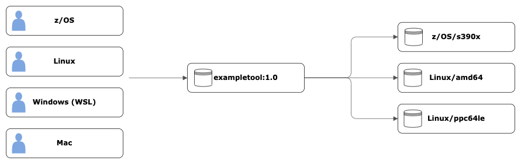

# Building and running multi-architecture images with IBM z/OS Container Platform

With the release of the IBM z/OS Container Platform, you now have the ability to build, run, manage, and orchestrate containers natively on z/OS. Containers bring with them the promise of portable containerized software that can be packaged, distributed, and run on multiple platforms.


|  |
| :---: |
| *Pulling a multi-architecture container image* |


You are going to take full advantage of that promise here, and approach building a simple tool that you package up as a multi-architecture container image. This allows users to interact with the tool in a consistent manner across all supported platforms.

The objective is to build a containerized tool that:
- Can run on any environment capable of running Linux and z/OS containers.
- Has a consistent user experience (within reason) regardless of platform.

### Prerequisites

If you want to try this out you need:

- A system (amd64/ppc64le/s390x) capable of running Linux containers with podman/docker setup.
  - Any recent Linux distribution
  - Mac with Podman/Docker setup with a `podman machine` running
  - Windows running Windows Subsystem for Linux (WSL) with Podman/Docker setup
- A z/OS system with Podman setup through IBM z/OS Container Platform
- An internal image registry that you can use to share container images between systems
  - Replace the `<internal-registry-location>` value in all of the commands after this with your internal image registry URL and directory where you would like the image to be located.
  - The `icr.io/zoscp/ibmjava:8` image should already be visible via the `podman images` command.

### Podman and Docker usage

In this article you will see how to build a multi-architecture container image. The approach will involve building images on each platform you wish to support for your image. Both Podman and Docker now support building all platform-specific images on the same system through emulation. This isn't currently available for the `zos/s390x` platform and therefore won't be covered. 

### The test tool

Source: [ExampleTool.java](src/java/ExampleTool.java)

The example tool is intentionally basic so you can focus on building and running multi-architecture container images.

The tool is written for Java 8 and performs the following actions:
- Validates and accepts a single `--input` argument and file name.
- Reads the supplied input file and produces an error if it cannot be found or read.
- Prints a message identifying the file that it read.
- Prints the input file contents.

### Base image considerations

Throughout this article, you use the `icr.io/appcafe/ibmjava:8-*` images. These images are multi-architecture images that can cover a variety of Linux supported architectures (amd64/ppc64le/s390x) using a single Containerfile. Although these images cover the s390x architecture, they support the Linux/s390x platform rather than z/OS/s390x. 

To keep things simple, a separate `src/resources/Containerfile.zos` will be used for z/OS that uses the `icr.io/zoscp/ibmjava:8` image. There are no separate SDK/JRE images for z/OS.

### Preparing your directory (Linux)

You will start by building a Linux container image on a suitable Linux system. Once you are logged in to your system, create the following directory structure that uses the contents from the [sample source](src) directory, and copy the contents onto the host. Optionally, use git to clone this repository or download the repository compressed file from GitHub. You need to perform the same action to transfer the repository to your z/OS system.

```
basic-image-building/
|- src/
|- src/input/
|- src/input/hello.txt
|- src/java/
|- src/java/ExampleTool.java
|- src/resources/
|- src/resources/Containerfile.linux
|- src/resources/Containerfile.zos
```

In your terminal, change to the `basic-image-building` directory. 

### Building the tool (Linux)

To build the container image, you need the Containerfile for Linux `src/resources/Containerfile.linux`. 

The Containerfile will:
- Compile the Java source files
- Copy the resultant Java class file into the container image
- Inform the container on how to run the tool by providing an `ENTRYPOINT`

The Containerfile uses a multi-stage build. In the first "builder" stage it compiles the Java source files. Notice that this stage uses the `icr.io/appcafe/ibmjava:8-sdk` image as a base image. This is required for the `javac` command.

In the final stage, only the Java class file is copied from the "builder" stage into the container image. This stage also switches the base image to `icr.io/appcafe/ibmjava:8-jre` as you only want the Java runtime in the final image. 

Build the container image on your Linux system. When you build the container image the first time, it could take longer to build, as it needs to pull both the SDK and JRE Java images. The image is tagged with `1.0-linux` to highlight that it is the Linux image for version 1.0 of the tool.

```
podman build -f src/resources/Containerfile.linux -t <internal-registry-location>/exampletool:1.0-linux .
```

When the build is successful, you should see the image returned in `podman images`.

```sh
basic-multi-arch-image$ podman images
REPOSITORY                                    TAG         IMAGE ID      CREATED         SIZE
<internal-registry-location>/exampletool      1.0-linux   4c984233df56  27 seconds ago  292 MB
```

### Running the tool (Linux)

With the container image built, run the container:

```sh
basic-multi-arch-image$ podman run -it --rm <internal-registry-location>/exampletool:1.0-linux
Invalid arguments.
Usage: java ExampleTool --input <input-file>
```

The container has run correctly and returned output asking for an additional input parameter.

### Running the tool with input (Linux)

With the tool now running, you need to provide it an input file to read. To provide this file, you must ask Podman/Docker to mount the input file from the host file system into the container file system. 

Use the provided `src/input` directory as your host directory to be mounted into the container.

```sh
basic-multi-arch-image$ podman run -it --rm -v $PWD/src/input:/input <internal-registry-location>/exampletool:1.0-linux --input /input/hello.txt
Hello from the ExampleTool.
```

There is quite a lot going on in that `podman run` command now, so let's break it down.

The start of the command, tells Podman/Docker to run the container interactively (`-it`) and remove (`--rm`) the container when it exits.

```
podman run -it --rm
```

The host directory is mounted by using the volume (`-v`) argument. The argument is passed two values that are separated by a `:`. To the left is the full path to the host directory that you would like to mount into the container. The `$PWD` is replaced by the shell with the full path of the current working directory. To the right is the full path to the mounted directory inside the container. The `src/input` directory will be mounted into the container at `/input`.

```
-v $PWD/input:/input
```

The rest of the command is made up of the image location `<internal-registry-location>/exampletool:1.0-linux` and the arguments that you are passing to the tool itself. These are combined with the container `ENTRYPOINT` when the container runs.

```
<internal-registry-location>/exampletool:1.0-linux --input /input/hello.txt
```

### Pushing our image (Linux)

With the Linux image now built, push it to your internal repository.

```
podman push <internal-registry-location>/exampletool:1.0-linux
```

Finally, remove the local image. You do not need to do this but it will be easier to see what is going on in later steps.

```
podman rmi <internal-registry-location>/exampletool:1.0-linux
```

### Building the image (z/OS)

We are now ready to build the container image for z/OS. Login to your z/OS system and re-create the same directories and files via SCM, compressed file or manually.

```
basic-multi-arch-image/
|- src/
|- src/input/
|- src/input/hello.txt
|- src/java/
|- src/java/ExampleTool.java
|- src/resources/
|- src/resources/Containerfile.linux
|- src/resources/Containerfile.zos
```

To ensure the source files are correctly encoded run the following command to tag all files under the `src` directory as ISO8859-1 encoded.

```
chtag -Rtc iso8859-1 src
```

The steps for building container images on z/OS are the same as you ran on Linux. The first difference that you need to tackle though is using z/OS images with the `FROM` instructions in your Containerfiles. 

While the ibmjava:8-sdk and ibmjava:8-jre are both multi-architecture images, there is a separate ibmjava:8 image for z/OS containers, otherwise you could have re-used the same Containerfile for both platforms.

Let's build the new z/OS container image in the same way you did on your Linux system.

```
podman build -f src/resources/Containerfile.zos <internal-registry-location>/exampletool:1.0-zos .
```

### Running the tool (z/OS)

Remaining on z/OS, with the container image now built, run the container:

```sh
basic-multi-arch-image$ podman run -it --rm <internal-registry-location>/exampletool:1.0-zos
Invalid arguments.
Usage: java ExampleTool --input <input-file>
```

As with the Linux container, the tool running in the z/OS container returned asking for the additional input parameter.

Running the container again with the mounted host directory for input, run the command:

```sh
basic-multi-arch-image$ podman run -it --rm -v $PWD/input:/input <internal-registry-location>/exampletool:1.0-zos --input /input/hello.txt
Hello from the ExampleTool.
```

### Pushing your image (z/OS)

With the z/OS image now built, push it to your internal repository.

```
podman push <internal-registry-location>/exampletool:1.0-zos
```

With the image now pushed, remove the local image. Again, you do not need to do this but it will be easier to see what is going on in the next steps.

```
podman rmi <internal-registry-location>/exampletool:1.0-zos
```

### Preparing for multi-architecture images

Let's now take the first proper foray into building a multi-architecture container image. You have built, tested, and pushed an image for both of the platforms you wanted to support and while you have now done enough to support those platforms, a user of the tool would need to remember to specify the right tag for their platform rather than letting Podman or Docker figure it out.

The solution to this is to create a manifest list to map each of your platform images to the platform they were built for. This allows a user on any supported platform, to use the same image location `<internal-registry-location>/exampletool:1.0` and receive the image for their platform of choice, ready to be run. You will see that in action shortly.

The process for creating a manifest is remarkably straight-forward. You can run these steps from either the z/OS or Linux system.

First, create the manifest list itself.

```
podman manifest create <internal-registry-location>/exampletool:1.0
```

Add both images to your manifest list. You do not need to have the images pulled locally for this to work.

```
podman manifest add <internal-registry-location>/exampletool:1.0 <internal-registry-location>/exampletool:1.0-linux
podman manifest add <internal-registry-location>/exampletool:1.0 <internal-registry-location>/exampletool:1.0-zos
```

You should now see your local manifest list with `podman images` and you can inspect the manifest with `podman manifest inspect` and see that the images were correctly added for each platform.

```sh
basic-multi-arch-image$ podman manifest inspect <internal-registry-location>/exampletool:1.0
{
    "schemaVersion": 2,
    "mediaType": "application/vnd.docker.distribution.manifest.list.v2+json",
    "manifests": [
        {
            "mediaType": "application/vnd.oci.image.manifest.v1+json",
            "size": 1076,
            "digest": "sha256:06c332ffa8a15c9722063296adf27d7b5845a789b580a5b2e39ff0d5e7152699",
            "platform": {
                "architecture": "amd64",
                "os": "linux"
            }
        },
        {
            "mediaType": "application/vnd.oci.image.manifest.v1+json",
            "size": 964,
            "digest": "sha256:d4c49100775c4939e32cf0e2f7719d4fdc57c2c1c3e1cd748081d182f04941d6",
            "platform": {
                "architecture": "s390x",
                "os": "zos"
            }
        }
    ]
}
```

With everything now prepared, push your manifest list to the internal registry. The multi-architecture image is now ready to be used.

```
podman manifest push <internal-registry-location>/exampletool:1.0
```

Finally, remove the manifest list from your local image storage. You do not need to clean this up but it helps to see exactly what is being pulled when the multi-architecture image is used.

```
podman rmi <internal-registry-location>/exampletool:1.0
```

### Running the multi-architecture container image

All that is left for you to do now is to experiment with running the container on your Linux and z/OS systems.

First make sure that all previous images/manifest lists are removed and do not appear in `podman images` (if not use `podman rmi` to remove them). Then attempt to run your containerised tool on both systems.

```sh
basic-multi-arch-image$ podman run -it --rm -v $PWD/src/input:/input <internal-registry-location>/exampletool:1.0 --input /input/hello.txt
Hello from the ExampleTool.
```

By specifying the `1.0` version tag, the container image matching your current platform is pulled locally to run the container. Inspect the image and format out the Operating System and architecture information to show that the image being used matches your system.

```sh
podman inspect -f '{{.Os}}-{{.Architecture}}' <internal-registry-location>/exampletool:1.0
zos-s390x
```

### Conclusion

You have now seen how to quickly provide a consistent product experience with multi-architecture container images. This sample has focused on the basic mechanics of creating and building multi-architecture container images for both native z/OS and Linux using the same standard tools in both environments. In a future article(s) you will delve a little deeper into dealing with file output and logging concerns.

